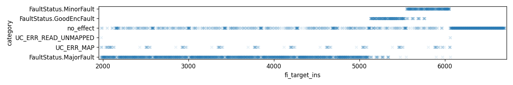
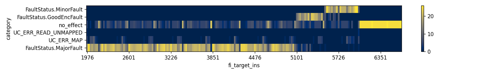

Use [qiling](https://github.com/qilingframework/qiling) unicorn/qemu wrapper to simulate faults on `test_aes` by iterating through the execution and skipping instructions with `hook_code` (`ql.reg.pc += size + 1`). USe [phoenixAES](https://github.com/SideChannelMarvels/JeanGrey) to recover the key from the faulty outputs.

- `python3.9 -m venv venv`
- `. venv/bin/activate`
- `pip install -r requirements.txt`
- `python sim.py | tee sim.log` (takes a few minutes, assumes `test_aes.elf` exists)
- `python extract_outbufs.py > sim.log.outbufs` 
- `python phoenixaes_recover.py` (assumes the first line of the file contains the correct output) 

Final output of `python phoenixaes_recover.py`:
```
$ python phoenixaes_recover.py 
Last round key #N found:
6B470A7D5F6CBA539BE5B2489C0BE0DC
ik10: 6B470A7D5F6CBA539BE5B2489C0BE0DC

ik00 matches refkey!
ik00: df92119f723cb00a121f232e0cfa7d26
ik01: f36de6618151566b934e75459fb40863
ik02: 7c5d1dbafd0c4bd16e423e94f1f636f7
ik03: 3a58751bc7543ecaa916005e58e036a9
ik04: d35da671140998bbbd1f98e5e5ffae4c
ik05: d5b98fa8c1b017137caf8ff6995021ba
ik06: a6447b4667f46c551b5be3a3820bc219
ik07: cd61af55aa95c300b1ce20a333c5e2ba
ik08: ebf95b96416c9896f0a2b835c3675a8f
ik09: 754728b8342bb02ec489081b07ee5294
ik10: 6b470a7d5f6cba539be5b2489c0be0dc
```

Plots of instruction skip timing vs. effect:



